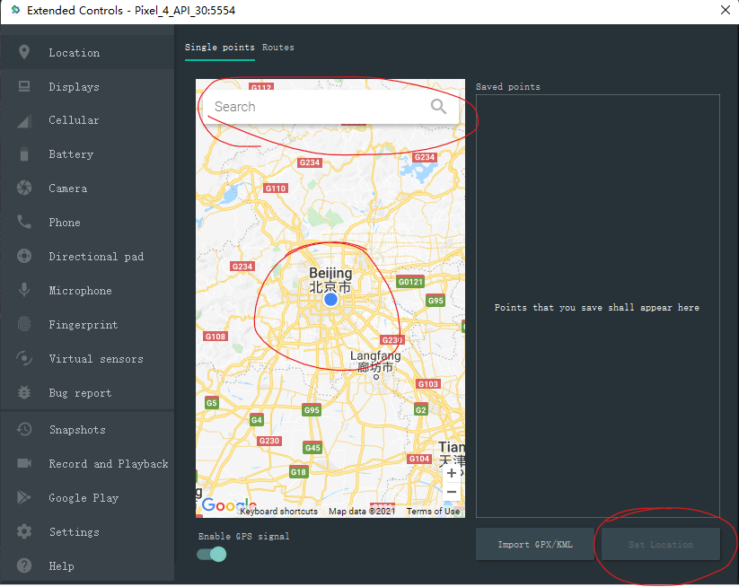
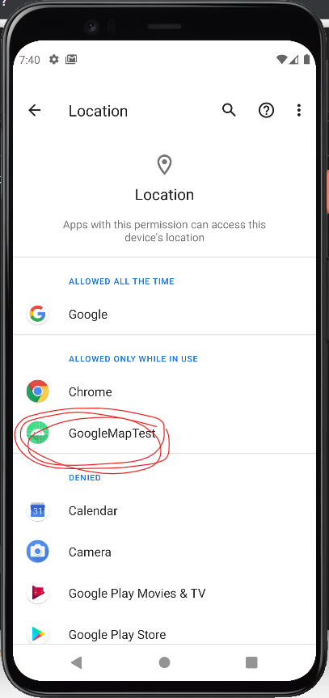
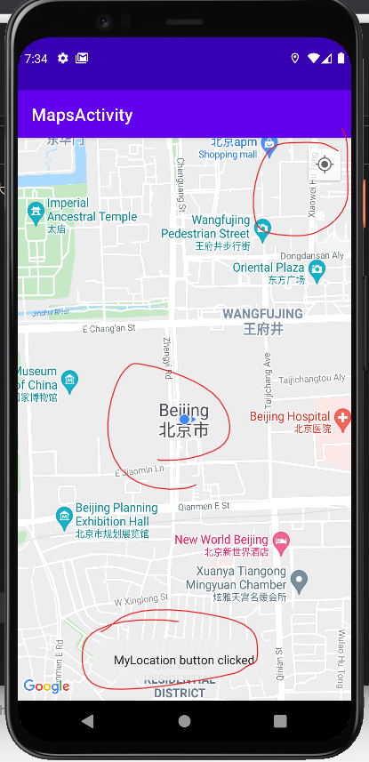

# GoogleMapTest

## 第3次作业

- 运行步骤和结果截图

    - 设置当前位置 
        
    
    - 授予应用获取当前位置的权限 
        
    
    - 点击定位按钮 
        
    
    - 点击当前位置会弹出当前具体位置的Toast

## 第4次作业

### 3种近场通信技术的特点

#### Wi-Fi

- Wi-Fi 这个术语经常被误以为是指无线保真(Wireless Fidelity), 类似历史悠久的音频设备分类: 长期高保真或 Hi-Fi, 事实上, Wi-Fi 一词没有任何意义, 也没有全写

- 无线电波覆盖范围较广, Wi-Fi 半径可达100米, 适宜单位楼层以及办公室内部运用, 而蓝牙技术只能覆盖15米内

- 速度快, 最高带宽11Mbps, 可靠性高, 在信号有干扰或者比较弱的情况下可以自动调整到1Mbps, 2Mbps, 5.5Mbps

- 无线通信

#### Bluetooth

- 蓝牙工作在2.4GHz的 ISM 频段

- 可以同时传输语音和数据

- 可以建立临时性的对等连接

- 具有很好的抗干扰能力

- 蓝牙模块体积很小, 便于集成

- 蓝牙设备在通信连接时分为4种工作模式: Active, Sniff, Hold, Park, 功耗降低

- 开放的接口标准

- 成本低

### NFC

- NFC略胜蓝牙的地方在于设置程序较短，但无法达到低功率蓝牙（Bluetooth Low Energy）的传输速率。在两台NFC设备相互连接的设备识别过程中，使用NFC来替代人工设置会使创建连接的速度大大加快：少于十分之一秒。NFC的最大资料传输量424 kbit/s远小于Bluetooth V2.1（2.1 Mbit/s）。虽然NFC在传输速度与距离比不上蓝牙（小于20 cm），但相应可以减少不必要的干扰。这让NFC特别适用于设备密集而传输变得困难的时候。

- 相对于蓝牙，NFC兼容于现有的被动RFID（13.56 MHz ISO/IEC 18000-3）设施。NFC的能量需求更低，与蓝牙V4.0低功耗协议类似。当NFC在一台无供电的设备（比如一台关机的手机，非接触式智能信用卡，或是智能海报）上工作时，NFC的能量消耗会要大于低功率蓝牙V4.0。

- 对于移动电话或是行动消费性电子产品来说，NFC的使用比较方便。NFC的短距离通信特性正是其优点，由于耗电量低、一次只和一台机器链接，拥有较高的保密性与安全性，NFC有利于信用卡交易时避免被盗用。NFC的目标并非是取代蓝牙等其他无线技术，而是在不同的场合、不同的领域起到相互补充的作用。

### 对未来近场通信技术的应用场景进行分析和预测

- 我无法预见三者的地位和负责的部分在短期内会有大的变动
