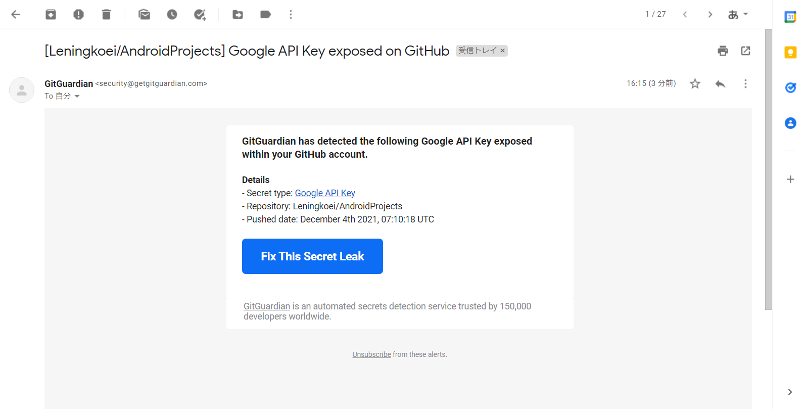

#   GoogleMapTest
-   直接上传GayHub之后会被提示 API Key 被暴露, 所以稍微匿名下 API Key 
    
-   运行步骤和结果截图
    -   设置当前位置 
        
    -   授予应用获取当前位置的权限 
        
    -   点击定位按钮 
        
    -   点击当前位置会弹出当前具体位置的Toast
